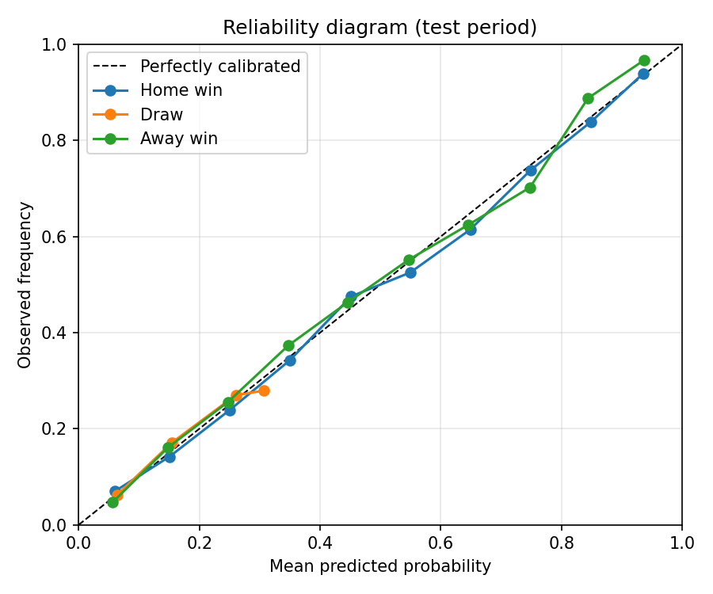

# SportPredict Core

[](https://github.com/USERNAME/sportpredict-core/actions/workflows/ci.yml)
[](https://github.com/USERNAME/sportpredict-core/actions/workflows/release.yml)

[](LICENSE)

Research module of the **SportPredict** project: point-in-time **Elo ratings** for national
football teams and **probabilistic forecasts** of match outcomes (home win / draw / away win),
evaluated with proper scoring rules on a strictly time-based backtest.

## Results (v0.1.0)

Train: 2010-01-01 – 2021-12-31 (11 271 matches) · Test: 2022-01-01 – 2026-10-06 (5 068 matches)

| Model | Accuracy ↑ | Brier ↓ | Log-loss ↓ | RPS ↓ |
|---|---|---|---|---|
| Uniform (1/3 each) | 0.295 | 0.667 | 1.099 | 0.240 |
| Climatology (train frequencies) | 0.477 | 0.633 | 1.050 | 0.229 |
| **Elo + ordered logit** | **0.602** | **0.515** | **0.876** | **0.172** |



Reproduce with one command (the dataset version is pinned to a commit):

```bash
sportpredict backtest --train-start 2010-01-01 --test-start 2022-01-01 --out results
```

The same command runs in CI on every push to `main`; metrics appear in the job summary and the
`backtest-results` artifact.

## Installation

```bash
git clone https://github.com/USERNAME/sportpredict-core.git
cd sportpredict-core
python -m venv .venv && source .venv/bin/activate   # Windows: .venv\Scripts\activate
pip install -e ".[dev]"
```

Or install a released wheel from the [Releases](https://github.com/USERNAME/sportpredict-core/releases) page.

## Usage

```bash
sportpredict ratings --top 10                       # current Elo top-10
sportpredict backtest --data data/sample_matches.csv \
    --train-start 2018-01-01 --test-start 2023-01-01 --out results
```

```python
from sportpredict.data import load_matches
from sportpredict.backtest import backtest

res = backtest(load_matches(), train_start="2010-01-01", test_start="2022-01-01")
print(res.metrics["elo_ordered_logit"])
```

### Quickstart example

```bash
python examples/quickstart.py "Kazakhstan" "Norway"
```

## Method

1. **Data** – [`martj42/international_results`](https://github.com/martj42/international_results)
   (CC0), pinned to commit `b7a3a8e`; schema and value checks in `data.validate`.
2. **Elo ratings** – World Football Elo rules: K = 60 (World Cup), 50 (continental finals),
   40 (qualifiers), 30 (other), 20 (friendlies), goal-difference multiplier, +100 home advantage.
   Each match gets ratings **before** kick-off, so features contain no future information.
3. **Ordered logit** – P(Y ≤ j) = σ(θⱼ − β·Δ/100), fitted by maximum likelihood
   (Hvattum & Arntzen, 2010).
4. **Evaluation** – accuracy, multi-class Brier score, log-loss and ranked probability score (RPS);
   baselines: uniform and climatology.

## Project structure

```
src/sportpredict/   data.py  elo.py  model.py  metrics.py  backtest.py  plots.py  cli.py
tests/              unit and integration tests (pytest, coverage >= 85 % enforced)
data/               sample_matches.csv (2016–2025 subset for tests and offline runs)
.github/workflows/  ci.yml (lint → test matrix → build, reproduce)  release.yml (tag → Release)
```

## Technology choices

| Need | Choice | Why |
|---|---|---|
| Language | Python 3.10+ | De-facto standard for data science; same language as the rest of SportPredict |
| Numerics | NumPy, pandas | Vectorised arrays and time-indexed tables |
| Estimation | SciPy `optimize` | MLE of a 3-parameter model without a heavy ML framework |
| Plots | Matplotlib | Publication-quality static figures |
| Tests | pytest + pytest-cov | Concise fixtures and parametrisation, coverage gate |
| Lint/format | Ruff | One fast tool replaces flake8 + isort + black |
| CI/CD | GitHub Actions | Native to GitHub, free for public repositories |

## Known limitations

See [issues](https://github.com/USERNAME/sportpredict-core/issues). Most notably, the ordered logit
never makes *draw* the most likely outcome (max P(draw) ≈ 0.31), which caps accuracy; a
draw-inflated model is on the roadmap.

## Citation

See [`CITATION.cff`](CITATION.cff).

## License

Code: [MIT](LICENSE). Data: CC0 1.0 (`international_results` by Mart Jürisoo).
